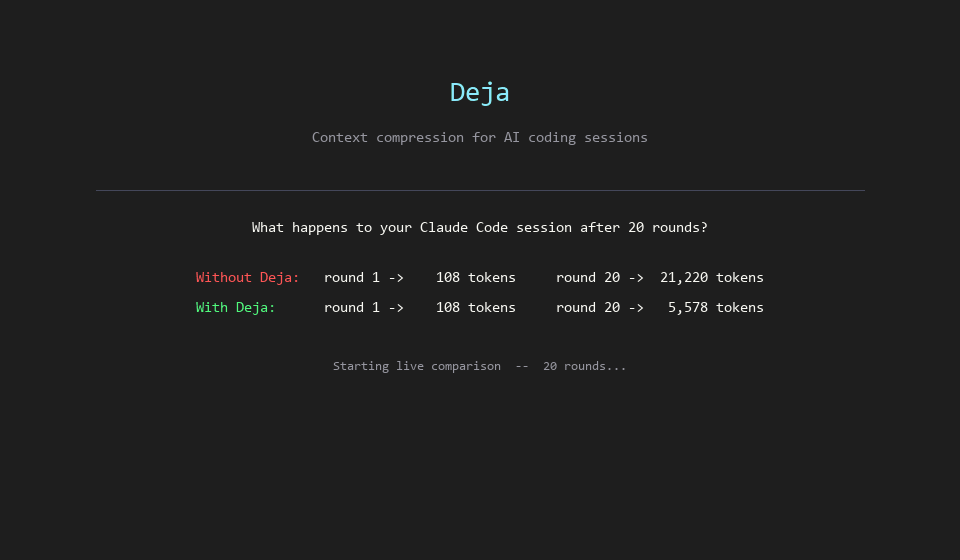

# Deja

Stop Claude Code from getting worse in long sessions.



| | Baseline | Deja | Δ |
|---|---|---|---|
| Token usage (20 rounds) | 213,721 | 60,628 | **-71.6%** |
| Response quality | 7.4 / 10 | 8.2 / 10 | **+0.8** |
| Memory retention | 10 / 10 | 10 / 10 | **✓** |

> Real Claude Sonnet API calls, 20-round coding session, no mocking. Full data in [`benchmarks/`](./benchmarks/).

---

## The Problem

You open Claude Code (or any long AI coding session) and start building. Hour two, something shifts. The model starts forgetting decisions from earlier. It contradicts itself. Responses get slower and more expensive.

This isn't a model limitation — it's a context problem. By round 20, your session is sending 21,000+ tokens of conversation history on every single request. Most of it is redundant.

```
Round  1:    108 tokens sent
Round  5:  4,568 tokens sent
Round 10: 10,153 tokens sent
Round 20: 21,220 tokens sent   ← paying for the entire session every time
```

Deja fixes this.

```
Round  1:    108 tokens sent   (same)
Round  5:  1,239 tokens sent   (-73%)
Round 10:  2,342 tokens sent   (-77%)
Round 20:  5,578 tokens sent   (-74%)   ← stable, not growing
```

---

## Why This Is Different

Most "prompt compression" tools just truncate old messages or summarize everything into a blob. That breaks reasoning chains and loses critical decisions.

Deja runs a **5-stage pipeline** on every request:

1. **Cleanup** — remove exact and near-duplicate messages (Jaccard similarity > 0.85)
2. **Ranking** — score each message: recency (40%) + content density (30%) + role (20%) + uniqueness (10%)
3. **Compression** — drop low-score messages, summarize medium-score ones with extractive summarization (no LLM needed)
4. **Memory inject** — retrieve relevant past context from a persistent vector store and prepend it
5. **Token budget** — hard ceiling enforcement, always preserving the last user message

The result: your context window contains the *right* history, not just the *recent* history.

---

## Features

- **Provider-agnostic** — Claude, OpenAI, or bring your own via `IProvider`
- **No external dependencies for compression** — scoring and summarization run locally, no extra API calls
- **Persistent memory** — 256-dim hash embeddings stored to `~/.deja/memory.json`, survives restarts
- **Eval harness built-in** — `npm run eval` or `npm run eval:long` to benchmark your own workloads
- **TypeScript-first** — strict types, ESM, Node 20+

---

## Run the Demo

The repo ships with a 60-second terminal demo that replays real benchmark data — no API calls required.

```bash
npm run demo
```

To record it as a GIF:

```bash
npm install -g @asciinema/cli agg
asciinema rec demo.cast --command "npx tsx src/cli/demo.ts"
agg demo.cast demo.gif --theme monokai --font-size 14
```

---

## Install

**Option 1 — npm (recommended):**

```bash
npm install -g deja-context
```

**Option 2 — from source:**

```bash
git clone https://github.com/Deja922/Deja
cd Deja
npm install
npm run build
```

Set your API key:

```bash
export ANTHROPIC_API_KEY=sk-...
# or
export OPENAI_API_KEY=sk-...
```

---

## CLI Usage

**Single prompt, compare baseline vs optimized:**

```bash
npx tsx src/cli/ai-context.ts run "Refactor this auth module to use JWT" \
  --context examples/life-sim-system.json \
  --mode both
```

Output:
```
┌─────────────┬───────────┬───────────┬──────────┬─────────┬──────────┐
│ Mode        │ Prompt T  │ Compl T   │ Savings  │ Quality │ Latency  │
├─────────────┼───────────┼───────────┼──────────┼─────────┼──────────┤
│ baseline    │     1,188 │       412 │        — │     7.2 │  4,210ms │
│ optimized   │       776 │       398 │  +34.7%  │     7.8 │  3,890ms │
└─────────────┴───────────┴───────────┴──────────┴─────────┴──────────┘
```

**Run the eval harness (5 task types):**

```bash
npm run eval -- --provider claude --mode both
```

**Run the long-session benchmark (20 rounds):**

```bash
npm run eval:long -- --provider claude --rounds 20
```

---

## Use as a Library

```typescript
import { Pipeline, loadConfig } from './src/core/index.js'
import { ClaudeProvider } from './src/providers/claude.js'

const pipeline = new Pipeline()
const config = await loadConfig({ maxTokens: 8000, targetTokens: 3000 })

const { context: compressed, stats } = await pipeline.run(context, config)

console.log(`${stats.originalTokens} → ${stats.outputTokens} tokens`)
console.log(`Dropped ${stats.messagesDropped}, summarized ${stats.messagesSummarized}`)

const provider = new ClaudeProvider()
const response = await provider.send({ context: compressed, maxTokens: 1024 })
```

---

## Architecture

```
Your app
   │
   ▼
┌──────────────────────────────────────────────┐
│  Pipeline                                    │
│                                              │
│  1. Cleanup      dedup + remove noise        │
│  2. Ranking      score each message 0–1      │
│  3. Compression  drop + extractive summary   │
│  4. Memory       inject relevant past turns  │
│  5. Budget       hard token ceiling          │
└──────────────────────────────────────────────┘
   │
   ▼
LLM API  (Claude / OpenAI / local)
```

Pure TypeScript, no native dependencies. Compression runs locally — no extra LLM calls.

---

## Configuration

```json
{
  "maxTokens": 8000,
  "targetTokens": 3000,
  "compressionRatio": 0.6,
  "rankingThreshold": 0.3,
  "memoryEnabled": true,
  "memoryTopK": 3
}
```

Sweet spot for most coding sessions: `targetTokens: 3000–4000`.

---

## Benchmarks

Full raw data in [`benchmarks/`](./benchmarks/).

**20-round long session (Claude Sonnet, real API):**

| Metric | Baseline | Deja | Δ |
|---|---|---|---|
| Total prompt tokens | 213,721 | 60,628 | **-71.6%** |
| Final round tokens | 21,220 | 5,578 | **-73.7%** |
| Avg response quality | 7.4 / 10 | 8.2 / 10 | **+0.8** |
| Memory retention | 10 / 10 | 10 / 10 | 0 |
| Reasoning stability | 8.7 / 10 | 8.4 / 10 | -0.3 |

---

## Roadmap

- [ ] Streaming support
- [ ] OpenAI text-embedding-3-small for better memory retrieval
- [ ] Session replay from `.jsonl` logs
- [ ] VS Code / Cursor extension
- [ ] SQLite memory backend
- [ ] Cost tracking ($ saved per session)

---

## Tests

```bash
npm test
npm run typecheck
```

---

## License

MIT
